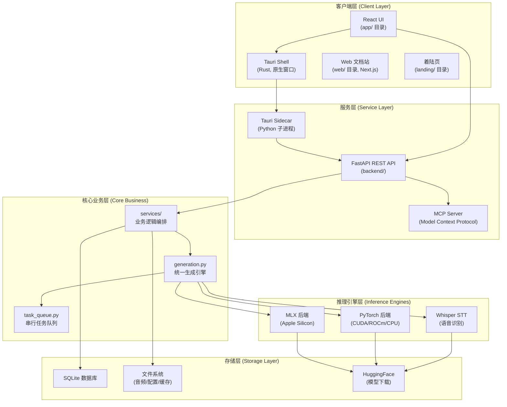
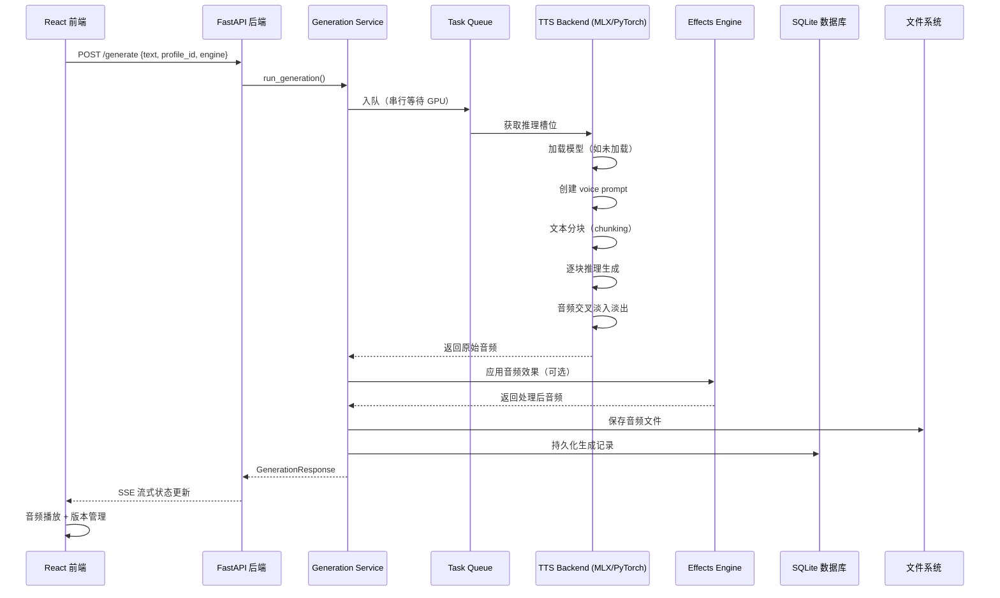
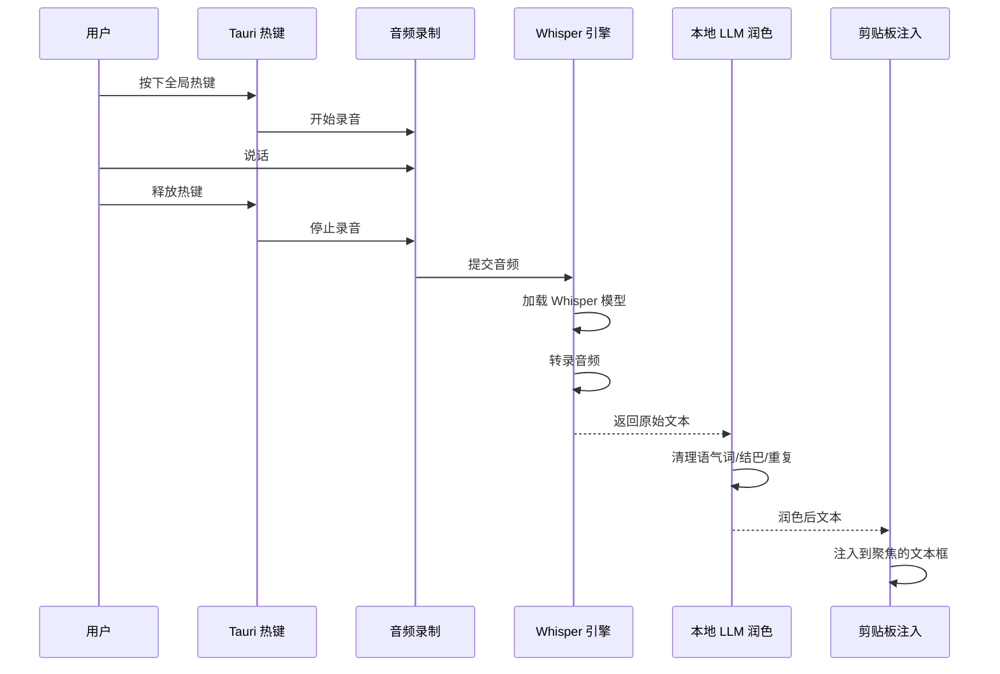
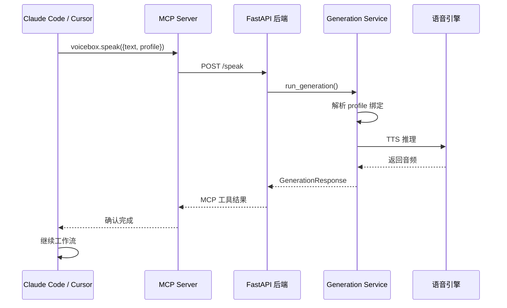
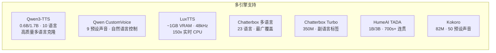

# Voicebox 架构分析：开源 AI 语音工作室

> 本文档基于 GitHub 仓库 [jamiepine/voicebox](https://github.com/jamiepine/voicebox) 的深入分析，全面解读其用途、技术架构和核心模块设计。

---

## 一、项目用途

### 定位

**Voicebox** 是一个 **本地优先（local-first）的 AI 语音工作室**，定位为 **ElevenLabs（云端 TTS）** 和 **WisprFlow（云端 STT）** 的开源替代方案，将两者的功能整合为一个桌面应用。

### 核心价值

| 价值 | 说明 |
|------|------|
| **完全隐私** | 所有模型、语音数据和录音在本地运行，永不离开用户机器 |
| **双向语音 I/O** | 同时覆盖语音输入（听写/STT）和语音输出（TTS），形成完整的语音循环 |
| **7 个 TTS 引擎** | 支持 Qwen3-TTS、LuxTTS、Chatterbox、HumeAI TADA、Kokoro 等 |
| **23 种语言** | 从英语到阿拉伯语、日语、印地语、斯瓦希里语等 |
| **MCP Agent 集成** | 通过 Model Context Protocol 让任何 AI Agent（Claude Code、Cursor 等）"开口说话" |
| **原生性能** | 基于 Tauri（Rust）而非 Electron |

### 目标用户场景

- **内容创作者**：多语言配音、有声读物、播客制作
- **开发者**：通过 REST API / MCP Server 集成语音能力到自己的应用
- **AI Agent 使用者**：给 Claude Code、Cursor 等编程助手配置"声音"
- **有声内容需求者**：将长文本（50K 字符）合成为自然语音
- **多语言沟通者**：在 23 种语言之间进行语音转换

---

## 二、系统架构总览

### 分层架构图



### 技术栈

| 层级 | 技术 | 说明 |
|------|------|------|
| **桌面框架** | Tauri 2.x (Rust) | 原生窗口，低内存占用 |
| **前端 UI** | React + TypeScript | app/ 目录，组件化 UI |
| **后端 API** | Python + FastAPI | 90 个 REST 端点 |
| **数据库** | SQLite + SQLAlchemy ORM | 轻量级本地持久化 |
| **TTS 推理** | MLX (Apple) / PyTorch (NVIDIA/AMD/CPU) | 多后端自适应 |
| **STT 推理** | Whisper (Base/Turbo/Large) | 语音转文字 |
| **音频效果** | Spotify Pedalboard (Python) | 8 种实时音频效果 |
| **MCP 协议** | HTTP + stdio 双传输 | AI Agent 集成 |
| **构建工具** | Bun / Just / Biome | 快速构建与代码检查 |
| **文档** | Next.js + Fumadocs MDX | docs/ 目录 |

---

## 三、模块详解

### 3.1 前端层（app/）

**技术栈**: React + TypeScript + Tailwind CSS

```
app/
├── components/          # UI 组件
│   ├── GenerationForm   # 语音生成表单
│   ├── VoiceProfileManager  # 音色管理
│   ├── StoriesEditor    # 多轨道时间轴编辑器
│   └── EffectsPanel     # 音频效果面板
├── hooks/               # React Hooks
├── services/            # API 调用封装
├── stores/              # 状态管理
└── utils/               # 工具函数
```

### 3.2 后端层（backend/）

**技术栈**: Python + FastAPI + SQLAlchemy

```
backend/
├── app.py               # FastAPI 应用工厂
├── main.py              # 入口点（uvicorn）
├── config.py            # 数据目录与配置
├── models.py            # Pydantic 请求/响应 Schema
├── server.py            # Tauri sidecar 启动器
│
├── routes/              # 路由层（薄封装）
│   ├── profiles.py      # 音色档案 CRUD
│   ├── generation.py    # TTS 生成
│   ├── transcription.py # STT 转录
│   ├── stories.py       # 故事编辑器
│   ├── effects.py       # 音频效果
│   └── models.py        # 模型管理
│
├── services/            # 业务逻辑层
│   ├── generation.py    # ★ 核心：统一生成引擎
│   ├── task_queue.py    # 串行 GPU 任务队列
│   ├── profiles.py      # 音色档案服务
│   ├── transcription.py # 转录服务
│   └── mcp.py           # MCP 协议处理
│
├── backends/            # 推理后端实现
│   ├── init.py          # ★ Protocol 定义 + 工厂函数
│   ├── base.py          # 共享工具
│   ├── mlx_backend.py   # Apple MLX 实现
│   └── pytorch_backend.py # PyTorch 实现
│
├── database/            # 数据持久化
│   ├── models.py        # SQLAlchemy ORM 模型
│   ├── session.py       # 会话管理
│   └── migrations/      # 自动迁移
│
└── utils/               # 工具库
    ├── audio.py         # 音频处理
    ├── effects.py       # Pedalboard 封装
    ├── platform_detect.py # 平台检测
    └── cache.py         # 缓存管理
```

### 3.3 Tauri 层（tauri/）

**技术栈**: Rust

负责：
- 原生窗口管理
- 全局快捷键绑定（听写热键）
- Sidecar 进程生命周期管理
- 系统级音频录制
- 无障碍 API 集成（macOS）
- 文件对话框等原生交互

### 3.4 文档与落地页

- **docs/**: Next.js + Fumadocs MDX，面向用户和开发者的完整文档
- **web/**: 文档站的 Web 版本
- **landing/**: voicebox.sh 营销落地页

---

## 四、核心数据流

### 4.1 TTS 生成流程



### 4.2 STT 听写流程



### 4.3 Agent MCP 调用流程



---

## 五、7 个 TTS 引擎对比



| 引擎 | 语言数 | 模型大小 | 核心优势 |
|------|--------|----------|----------|
| Qwen3-TTS | 10 | 0.6B/1.7B | 高质量克隆 + 自然语言指令 |
| Qwen CustomVoice | 10 | - | 9 种预设声音，无需参考音频 |
| LuxTTS | 1 | ~1GB | 轻量、48kHz、CPU 150x 实时 |
| Chatterbox 多语言 | 23 | - | 最广语言覆盖 |
| Chatterbox Turbo | 1 | 350M | 副语言标签 `[laugh]` `[sigh]` |
| HumeAI TADA | 10 | 1B/3B | 700s+ 连贯音频 |
| Kokoro | 8 | 82M | 50 预设声音，极快 CPU 推理 |

---

## 六、多平台支持架构

```mermaid
graph TB
    subgraph "macOS"
        direction TB
        AppleSilicon["Apple Silicon<br/>MLX + Metal<br/>NE 加速"]
        Intel["Intel Mac<br/>PyTorch + CPU"]
    end

    subgraph "Windows"
        direction TB
        NVIDIA_W["NVIDIA GPU<br/>PyTorch +